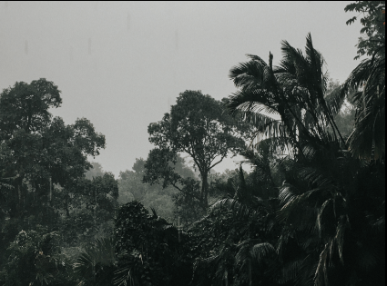

# CREATE A WEB-LAYOUT USING FLEXBOX

### AIM :
      To create a Web-Layout using FLEXBOX.
      
### ALGORITHM :
        Step 1: Start by creating a new folder. 
      	Step 2: Create and Open the “index.html”, write the code.
	      Step 3: Create a new CSS file “style.css” 
	      Step 4: Design the basic structure of your website using HTML tags like <header>,      
                        <nav>, <main>, and <footer>.
        Step 5: Implement navigation menus using HTML lists (<ul> or <ol>) and CSS                                                   
             styling.
      	Step 6: Test your website by opening the HTML file in a web browser. Make any  
                        necessary adjustments to the HTML and CSS code to achieve the desired   
                        layout and design.

### PROGRAM :

    index.html
            <!DOCTYPE html>
            <html lang="en">
              <head>
                <meta charset="UTF-8" />
                <meta http-equiv="X-UA-Compatible" content="IE=edge" />
                <meta name="viewport" content="width=device-width, initial-scale=1.0" />
                <title>Flex Property</title>
                <link rel="stylesheet" href="assets/css/style.css" />
              </head>
              <body>
                

                  
STORM&reg;

                  

                    

                    

                  

                

                

                  

                    
                    

                      OVERVIEW: WEATHER, GLOBAL WARMING AND 
                      CLIMATE CHANGE
                    

                    

                      "CLIMATE CHANGE" AND "GLOBAL WARMING" 
                      ARE OFTEN USED INTERCHANGEABLY BUT 
                      HAVE DISTINCT MEANINGS.
                    

                  

                  

                    
                    
THE WORLD IMPACT

                    
TIME FOR CHANGE

                    
SLOWING THE PROCESS

                  

                

              </body>
            </html>
            
     style.css
              /* This is css file  */
              @import url("https://fonts.googleapis.com/css2?family=Montserrat:ital,wght@0,100;0,200;0,300;0,400;0,500;0,600;0,700;0,800;0,900;1,100;1,200;1,300;1,400;1,500;1,600;1,700;1,800;1,900&family=Mulish:ital,wght@0,200;0,300;0,400;0,500;0,600;0,700;0,800;0,900;0,1000;1,200;1,300;1,400;1,500;1,600;1,700;1,800;1,900;1,1000&display=swap"); /*sag-09 */
              * {
                font-family: "Mulish", sans-serif;
                color: white;
              }
              body {
                margin: 0;
                background-color: #101010;
                color: white;
                font-family: "Montserrat", sans-serif;
              }

              body {
                background-color: black;
              }
              .nav {
                display: flex;
                background-color: black;
                position: sticky;
                top: 0;
                z-index: 100;
                justify-content: space-between;
                gap: 2rem;
              }
              .title {
                font-size: 80px;
                display: flex;
              }
              .nav span {
                margin-top: 26px;
                font-size: 30px;
              }
              .home {
                margin-top: 26px;
                margin-right: 10px;
                display: flex;
                width: 2rem;
                display: flex;
                flex-direction: column;
              }
              hr {
                border-top: 4px solid #ffffff;
                border-radius: 10px;
              }

              .master {
                display: flex;
                gap: 1.5rem;
                padding: 1rem;
              }
              .first {
                width: 60%;
                display: flex;
                flex-direction: column;
              }
              .first-image {
                height: 55vh;
                width: 100%;
              }
              .second {
                width: 40%;
                display: flex;
                flex-direction: column;
              }
              .second-image {
                height: 55vh;
                width: 100%;
              }
              .view {
                display: flex;
                font-size: 2.5rem;
                justify-content: flex-start;
              }
              .climate {
                display: flex;
                justify-content: flex-end;
                /* flex-direction: row-reverse; */
                font-weight: 250;
              }
              .cls1 {
                display: flex;
                padding: 1.5rem;
                border-bottom: 0.5px solid white;
              }

              @media (max-width: 768px) {
                .container-master {
                  flex-direction: column;
                }
                .container-left,
                .container-right,
                .container-bottom {
                  width: 100%;
                }
              }

             
### OUTPUT :

### RESULT :
        Thus, the HTML & CSS program to Create a Web-Layout using FLEXBOX has been implemented successfully. 

